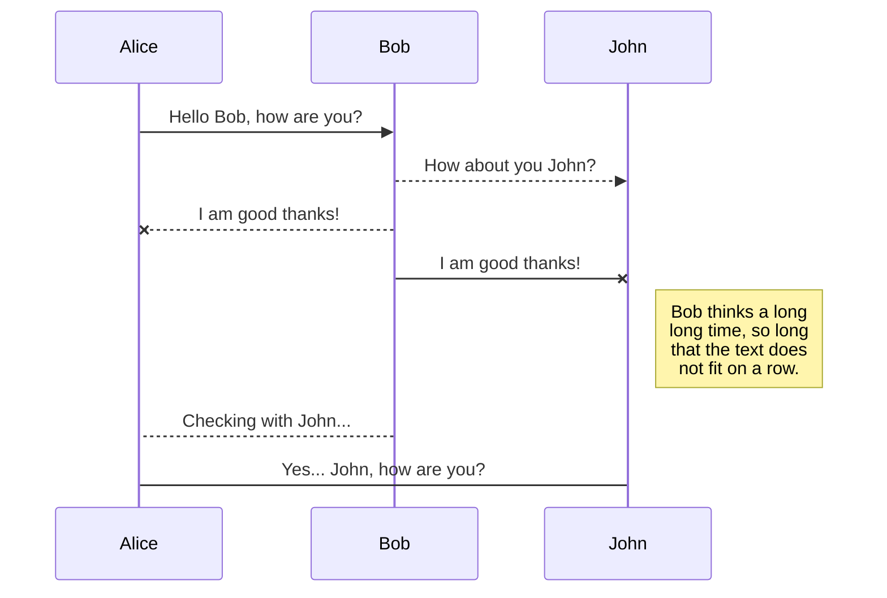

# Welcome to StackEdit!

Hi! I'm your first Markdown file in **StackEdit**. If you want to learn about StackEdit, you can read me. If you want to play with Markdown, you can edit me. Once you have finished with me, you can create new files by opening the **file explorer** on the left corner of the navigation bar.


# Files

StackEdit stores your files in your browser, which means all your files are automatically saved locally and are accessible **offline!**

## Create files and folders

The file explorer is accessible using the button in left corner of the navigation bar. You can create a new file by clicking the **New file** button in the file explorer. You can also create folders by clicking the **New folder** button.

## Switch to another file

All your files and folders are presented as a tree in the file explorer. You can switch from one to another by clicking a file in the tree.

## Rename a file

You can rename the current file by clicking the file name in the navigation bar or by clicking the **Rename** button in the file explorer.

## Delete a file

You can delete the current file by clicking the **Remove** button in the file explorer. The file will be moved into the **Trash** folder and automatically deleted after 7 days of inactivity.

## Export a file

You can export the current file by clicking **Export to disk** in the menu. You can choose to export the file as plain Markdown, as HTML using a Handlebars template or as a PDF.


# Synchronization

Synchronization is one of the biggest features of StackEdit. It enables you to synchronize any file in your workspace with other files stored in your **Google Drive**, your **Dropbox** and your **GitHub** accounts. This allows you to keep writing on other devices, collaborate with people you share the file with, integrate easily into your workflow... The synchronization mechanism takes place every minute in the background, downloading, merging, and uploading file modifications.

There are two types of synchronization and they can complement each other:

- The workspace synchronization will sync all your files, folders and settings automatically. This will allow you to fetch your workspace on any other device.
	> To start syncing your workspace, just sign in with Google in the menu.

- The file synchronization will keep one file of the workspace synced with one or multiple files in **Google Drive**, **Dropbox** or **GitHub**.
	> Before starting to sync files, you must link an account in the **Synchronize** sub-menu.

## Open a file

You can open a file from **Google Drive**, **Dropbox** or **GitHub** by opening the **Synchronize** sub-menu and clicking **Open from**. Once opened in the workspace, any modification in the file will be automatically synced.

## Save a file

You can save any file of the workspace to **Google Drive**, **Dropbox** or **GitHub** by opening the **Synchronize** sub-menu and clicking **Save on**. Even if a file in the workspace is already synced, you can save it to another location. StackEdit can sync one file with multiple locations and accounts.

## Synchronize a file

Once your file is linked to a synchronized location, StackEdit will periodically synchronize it by downloading/uploading any modification. A merge will be performed if necessary and conflicts will be resolved.

If you just have modified your file and you want to force syncing, click the **Synchronize now** button in the navigation bar.

> **Note:** The **Synchronize now** button is disabled if you have no file to synchronize.

## Manage file synchronization

Since one file can be synced with multiple locations, you can list and manage synchronized locations by clicking **File synchronization** in the **Synchronize** sub-menu. This allows you to list and remove synchronized locations that are linked to your file.


# Publication

Publishing in StackEdit makes it simple for you to publish online your files. Once you're happy with a file, you can publish it to different hosting platforms like **Blogger**, **Dropbox**, **Gist**, **GitHub**, **Google Drive**, **WordPress** and **Zendesk**. With [Handlebars templates](http://handlebarsjs.com/), you have full control over what you export.

> Before starting to publish, you must link an account in the **Publish** sub-menu.

## Publish a File

You can publish your file by opening the **Publish** sub-menu and by clicking **Publish to**. For some locations, you can choose between the following formats:

- Markdown: publish the Markdown text on a website that can interpret it (**GitHub** for instance),
- HTML: publish the file converted to HTML via a Handlebars template (on a blog for example).

## Update a publication

After publishing, StackEdit keeps your file linked to that publication which makes it easy for you to re-publish it. Once you have modified your file and you want to update your publication, click on the **Publish now** button in the navigation bar.

> **Note:** The **Publish now** button is disabled if your file has not been published yet.

## Manage file publication

Since one file can be published to multiple locations, you can list and manage publish locations by clicking **File publication** in the **Publish** sub-menu. This allows you to list and remove publication locations that are linked to your file.


# Markdown extensions

StackEdit extends the standard Markdown syntax by adding extra **Markdown extensions**, providing you with some nice features.

> **ProTip:** You can disable any **Markdown extension** in the **File properties** dialog.


## SmartyPants

SmartyPants converts ASCII punctuation characters into "smart" typographic punctuation HTML entities. For example:

|                |ASCII                          |HTML                         |
|----------------|-------------------------------|-----------------------------|
|Single backticks|`'Isn't this fun?'`            |'Isn't this fun?'            |
|Quotes          |`"Isn't this fun?"`            |"Isn't this fun?"            |
|Dashes          |`-- is en-dash, --- is em-dash`|-- is en-dash, --- is em-dash|


## KaTeX

You can render LaTeX mathematical expressions using [KaTeX](https://khan.github.io/KaTeX/):

The *Gamma function* satisfying $\Gamma(n) = (n-1)!\quad\forall n\in\mathbb N$ is via the Euler integral

$$
\Gamma(z) = \int_0^\infty t^{z-1}e^{-t}dt\,.
$$

> You can find more information about **LaTeX** mathematical expressions [here](http://meta.math.stackexchange.com/questions/5020/mathjax-basic-tutorial-and-quick-reference).


## UML diagrams

You can render UML diagrams using [Mermaid](https://mermaidjs.github.io/). For example, this will produce a sequence diagram:



And this will produce a flow chart:

```mermaid
graph LR
A[Square Rect] -- Link text --> B((Circle))
A --> C(Round Rect)
B --> D{Rhombus}
C --> D
```<div  style="display: flex; flex-direction: column; justify-content: center; align-items: center; height: 100vh;">
<h2>Labs 1-5</h2>
<p>Student ID: 24188515</p>
<p>Student Name: Dayu Liu</p>
</div>

# Lab 1
## AWS Account and Log in
### [1] Log into an IAM user account created for you on AWS.
After receiving the email with original login cridentials, I logged-in and reseted my password accordingly.


### [2] Search and open Identity Access Management
Clicked on the top-right panel to access `security cridentials`


Under the `access key` tab, create new access key and secret. Store the key and secret into somewhere private and secure.


## Set up recent Linux OSes

I am running a windows machine, I decided to go with `ubuntus on windows` because it offers an isolated environment and separated file directory, which sets ease with file management.


## Install Linux packages
### [1] Install Python 3.10.x
Because my ubuntu version is already `22.04`, I will get the lastest python version which is `3.10.12`.
To update apt to latest version:
```
sudo apt update
sudo apt -y upgrade
```

To check the latest version of python:
`python3 -V`

To install pip3:
`sudo apt install -y python3-pip`


### [2] Install awscli
To install AWS CLI and upgrade to latest version:
`pip3 install awscli --upgrade`


### [3] Configure AWS
To configure and connect to Amazon EC2:
`aws configure`


### [4] Install boto3
I find this step redundant as `botocore` is already inluded in AWS Cli package, but just for the spirit:
`pip3 install boto3`


## Test the installed environment
### [1] Test the AWS environment
To confirm that we are connected to the `AWS environment`, run a simple command which prints out the region table.
`aws ec2 describe-regions --output table`


### [2] Test the Python environment
We executed a command offered by AWS-Cli in the terminal, now we want to test on the python environment to achive a similar goal:
```
python3
>>> import boto3
>>> ec2 = boto3.client('ec2')
>>> response = ec2.describe_regions()
>>> print(response)
```


### [3] Write a Python script
Now we create a python script to wrap these lines in one file and also format the reponse into table structure.
The python script is located in `~\cits5503\lab1` in my Ubuntu machine.

#### (1) install dependencies
The pandas library is used here to convert un-tabulated data into structured table.
Run the following code to install the extra dependency
`pip install pandas`

#### (2) explain the code
The code in the script adds an extra step, the reponse data is sent as a parameter into pandas dataframe and then gets printed.
```
import boto3 as bt
import pandas as pd

ec2 = bt.client('ec2')
response = ec2.describe_regions()
regions = response['Regions']
regions_df = pd.DataFrame(regions)
print(regions_df)
```

#### (3) run the script

run the following code to execute the python script:
`python3 lab1.py`

#### [4] get the results
After the script is executed, results are printed in a table structure:
| --- | Endpoint | RegionName | OptInStatus |
| --- | --- | --- | --- |
0| ec2.ap-south-1.amazonaws.com| ap-south-1| opt-in-not-required
1| ec2.eu-north-1.amazonaws.com| eu-north-1| opt-in-not-required
2| ec2.eu-west-3.amazonaws.com| eu-west-3| opt-in-not-required
3| ec2.eu-west-2.amazonaws.com| eu-west-2| opt-in-not-required
4| ec2.eu-west-1.amazonaws.com| eu-west-1| opt-in-not-required
5| ec2.ap-northeast-3.amazonaws.com| ap-northeast-3| opt-in-not-required
6| ec2.ap-northeast-2.amazonaws.com| ap-northeast-2| opt-in-not-required
7| ec2.ap-northeast-1.amazonaws.com| ap-northeast-1| opt-in-not-required
8| ec2.ca-central-1.amazonaws.com| ca-central-1| opt-in-not-required
9| ec2.sa-east-1.amazonaws.com| sa-east-1| opt-in-not-required
10| ec2.ap-southeast-1.amazonaws.com| ap-southeast-1| opt-in-not-required
11| ec2.ap-southeast-2.amazonaws.com| ap-southeast-2| opt-in-not-required
12| ec2.eu-central-1.amazonaws.com| eu-central-1| opt-in-not-required
13| ec2.us-east-1.amazonaws.com| us-east-1| opt-in-not-required
14| ec2.us-east-2.amazonaws.com| us-east-2| opt-in-not-required
15| ec2.us-west-1.amazonaws.com| us-west-1| opt-in-not-required
16| ec2.us-west-2.amazonaws.com| us-west-2| opt-in-not-required

<div  style="page-break-after: always;"></div>

# Lab 2

## Create an EC2 instance using awscli
### [1] Create a security group
Create a security group with the name of my student number `24188516-sg`, `--group-name` specifies the group name and `--description` adds a description.
```
aws ec2 create-security-group --group-name 24188516-sg --description "security group for development environment"
```

The response will return the GroupId being created.
### [2] Authorise inbound traffic for ssh
Create a rule to add tcp permission to this security group, `--protocol` specifies which internet protocol, `--port` specifies which port used for connection and `--cidr` specifies IP routing.
```
aws ec2 authorize-security-group-ingress --group-name 24188516-sg --protocol tcp --port 22 --cidr 0.0.0.0/0
```


The response will return the newly created rule along with specific rulesets.

### [3] Create a key pair
Now we need to create a `private key` and `public key` pair for encrypted connection. The `generated private key` is then saved as plain-text into `24188516-key.pem` file.
```
aws ec2 create-key-pair --key-name 24188516-key --query 'KeyMaterial' --output text > 24188516-key.pem
```

To use this key on Linux, copy the file to a directory ~/.ssh and change the permissions to:
```
chmod 400 24188516-key.pem
```
This grants the owner of the file read permission, the output is as follow:


### [4] Create the instance 
Because my student number is `24188516`, create an ec2 instance in `eu-north-1` region. `--image-id` specifies ami id with preset configurations, mine is `ami-07a0715df72e58928`. `--instance-type` is set to t2.micro, and we are using the private key `24188516-key`
```
 aws ec2 run-instances --image-id ami-07a0715df72e58928 --security-group-ids 24188516-sg --count 1 --instance-type t3.micro --key-name 24188516-key --query 'Instances[0].InstanceId'
 ```

For some reason, at the moment I was working on the lab, t2.micro container is not supported so I switched to t3.micro. The instance is created with instance id `i-0553e2ea0492e1c73`


### [5] Add a tag to your Instance
Now we have the instance id `i-0553e2ea0492e1c73`, add a tag that specifies the name, the value should be my student number with -vm `24188516-vm` for using single instance.
 ```
  aws ec2 create-tags --resources i-0553e2ea0492e1c73 --tags Key=Name,Value=24188516-vm
 ```

### [6] Get the public IP address
describe-instances returns available information to the instance with `--instance-ids`, since we only want the IP address for ssh purpose, the query limits the output to only `Reservations[0].Instances[0].PublicIpAddress`
```
aws ec2 describe-instances --instance-ids i-0553e2ea0492e1c73 --query 'Reservations[0].Instances[0].PublicIpAddress'
```


### [7] Connect to the instance via ssh
Use the stored pem key to connect to the public IP `16.171.151.20` of the instance via SSH
```
ssh -i 24188516-key.pem ubuntu@16.171.151.20
```
Now that the server is connected, we can see system information on the console:


### [8] List the created instance using the AWS console
The original instance from step 1-7 was destoyed over night so you might see the instance id has changed because I had to create a new one. This is the screenshot:


## Create an EC2 instance with Python Boto3

The script uses boto3 package instead of cli commands. Names of some of the methods and parameters can vary but they achived the same goal. The Group name, key name and instance name all have an appendix **'-2'** to differentiate from the previous practice.

The code is as follows:
```
import  boto3  as  bt
import  os

# constants
GroupName  =  '24188516-sg-2'
KeyName  =  '24188516-key-2'
InstanceName=  '24188516-vm-2'

ec2  =  bt.client('ec2')

# 1 create security group
step1_response  =  ec2.create_security_group(
	Description="security group for development environment",
	GroupName=GroupName
)

# 2 authorise ssh inbound rule
step2_response  =  ec2.authorize_security_group_ingress(
	GroupName=GroupName,
	IpPermissions=[
		{
			'IpProtocol': 'tcp',
			'FromPort': 22,
			'ToPort': 22,
			'IpRanges': [{'CidrIp': '0.0.0.0/0'}]
		}
	]
)

# 3 create key-pair
step3_response  =  ec2.create_key_pair(KeyName=KeyName)
PrivateKey  =  step3_response['KeyMaterial']
## save key-pair
with  open(f'{KeyName}.pem', 'w') as  file:
file.write(PrivateKey)
## grant file permission
os.chmod(f'{KeyName}.pem', 0o400)

# 4 create instance
step4_response  =  ec2.run_instances(
	ImageId='ami-07a0715df72e58928',
	SecurityGroupIds=[GroupName],
	MinCount=1,
	MaxCount=1,
	InstanceType='t3.micro',
	KeyName=KeyName
)
InstanceId  =  step4_response['Instances'][0]['InstanceId']

# 5 create tag
step5_repsonse  =  ec2.create_tags(
	Resources=[InstanceId],
	Tags=[
		{
		'Key': 'Name',
		'Value': InstanceName
		}
	]
)

# 6 get IP address
step6_response  =  ec2.describe_instances(InstanceIds=[InstanceId])
# Extract the public IP address
public_ip_address  =  step6_response['Reservations'][0]['Instances'][0]['PublicIpAddress']

# print all responses
print(f"{step1_response}\n{step2_response}\n{PrivateKey}\n{InstanceId}\n{step5_repsonse}\n{public_ip_address}\n")
```

After the script is executed, the repsonses of each step is printed as follows:


Go to the AWS console to check the created instance;


## Use Docker inside a Linux OS

### [1][2][3] Install and run Docker
This command is used to install necessary packages for the Docker service.
```
sudo apt install docker.io -y
```
This command is used to start the Docker service immediately.
```
sudo systemctl start docker
```
This command is used to enable the Docker service to start automatically at boot time.
```
sudo systemctl enable docker
```


### [4] Check the version
After the Docker service is installed and enabled, run this command to check version and make sure it's working properly
```
docker --version
```


### [5] Build and run an httpd container
The file index.html is located inside the html directory and add the following content, which does a single thing to display a paragraph with text **"Hello, World!"**.
```
  <html>
    <head> </head>
    <body>
      <p>Hello World!</p>
    </body>
  </html>
```

Create a file called Dockerfile outside the html directory with the following content. This specifies Docker to use Apache HTTP Server version 2.4 and copy whatever inside **/html** folder to the destination directory inside the Docker container, which is **/usr/local/apache2/htdocs/**
```
FROM httpd:2.4
COPY ./html/ /usr/local/apache2/htdocs/
```

Add my current user **liudayubob** to the docker group to grant permission, reboot uBuntus console and build the docker image 
```
sudo usermod -a -G docker <username>
```


Build a docker image. This command tells docker to build the image under the current **/html** directory and add a tag called **my-apache2**
```
docker build -t my-apache2 .
```

Run the image. First parameter maps ports between the host machine and the Docker container to **port 80**, second paramater **'-dit'** runs the container in detached mode, keeps STDIN open and allocates a pseudo-TTY to let docker image run in background and enables interaction with the container. The container is named as **my-app** and uses **my-apache2** image built earlier.
```
docker run -p 80:80 -dit --name my-app my-apache2
```


Open a browser and access address: http://localhost or http://127.0.0.1. The html page is hosted and prints out "Hello World!"


### [6] Other docker commands

To check what is running.
```
docker ps -a
```


This prints out some properties of he running container, with the corresponding container name and image name that we assigned.

To stop and remove the container
```
docker stop my-app
docker rm my-app
```

<div  style="page-break-after: always;"></div>

# Lab 3

### [1] Preparation

Download the python code `cloudstorage.py` from the directory of [src](https://github.com/zhangzhics/CITS5503_Sem2/blob/master/Labs/src/cloudstorage.py) 

Create a directory `rootdir` 

Create a file in `rootdir` called `rootfile.txt` and write some content in it `1\n2\n3\n4\n5\n` 

Create a second directory in rootdir called `subdir`, and in the `subdir` directory create another file `subfile.txt` with the same content as `rootfile.txt`.

  

### [2] Save to S3 by updating `cloudstorage.py`

  

Modify the downloaded Python script, `cloudstorage.py`, to create an S3 bucket named `<student ID>-cloudstorage`.

  

When the program traverses the directory starting at the root directory `rootdir`, upload each file onto the S3 bucket. An easy way to upload files is to use the command below:

  

```

s3.upload_file()

```

  

**NOTE**: Make sure your S3 bucket has the same file structure as shown in `[1] Preparation`.

  

### [3] Restore from S3

  

Create a new program called `restorefromcloud.py` that reads the S3 bucket and writes the contents of the bucket within the appropriate directories.

  

**NOTE**: Your local Linux environment should see a copy of the files and the directories from the S3 bucket.

  

### [4] Write information about files to DynamoDB

  

Install DynamoDB on your Linux environment

  

```

mkdir dynamodb

cd dynamodb

```

  

Install jre if not done

  

```

sudo apt-get install default-jre

wget https://s3-ap-northeast-1.amazonaws.com/dynamodb-local-tokyo/dynamodb_local_latest.tar.gz

```

  

You can use the following command to extract files from dynamodb_local_latest.tar.gz

  

```

tar -zxvf dynamodb_local_latest.tar.gz

```

  

After the extraction, run the command below

  

```

java -Djava.library.path=./DynamoDBLocal_lib -jar DynamoDBLocal.jar –sharedDb

```

  

Alternatively, you can use docker:

```

docker run -p 8000:8000 amazon/dynamodb-local -jar DynamoDBLocal.jar -inMemory -sharedDb

```

**Note**: Do not close the current window, open a new window to run the following Python script.

  

Write a Python script to create a table called `CloudFiles` on your local DynamoDB and the attributes for the table are:

  

```

CloudFiles = {

'userId',

'fileName',

'path',

'lastUpdated',

'owner',

'permissions'

}

)

```

`userId` is the partition key and `fileName` is the sort key. Regarding the creation, refer to this [page](https://boto3.amazonaws.com/v1/documentation/api/latest/reference/services/dynamodb.html)

  

Then, you need to get the attributes above for each file of the S3 bucket and then write the attributes of each file into the created DynamoDB table. Regarding how to get the attributes for a file, refer to this [page](https://boto3.amazonaws.com/v1/documentation/api/latest/reference/services/s3/client/get_bucket_acl.html)

  

**NOTE**:

  

1) The table should have 2 items. One item corresponds to one file in the bucket and consists of the attributes above and their values.

  

2) Regarding the attribute `owner`, if you use a region in the table below, its value should be **owner's name**. Otherwise, its value should be **owner's ID**.

  

| Region | Region Name |

| --- | --- |

| US East (N. Virginia) | us-east-1 |

| Asia Pacific (Tokyo) | ap-northeast-1 |

| Asia Pacific (Singapore) | ap-southeast-1 |

| Asia Pacific (Sydney) | ap-southeast-2 |

  
  

### [5] Scan the table

  

Use AWS CLI command to scan the created DynamoDB table, and output what you've got.

  

### [6] Delete the table

  

Use AWS CLI command to delete the table.

  

**NOTE**: Delete the created S3 bucket from AWS console after the lab is done.

  

Lab Assessment:

  

A structured presentation (15%). A clear step-by-step with detailed descriptions (85%).

<div  style="page-break-after: always;"></div>

# Lab 4

<div  style="page-break-after: always;"></div>

# Lab 5
<!--stackedit_data:
eyJoaXN0b3J5IjpbMTM5OTk1NTExNiwtMzMyNDU1MzYzXX0=
-->